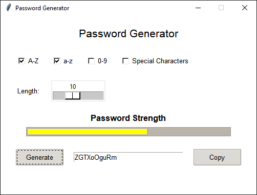

# Password Generator
Password Generator is coded in Python. The purpose of this project is to help you create strong passwords for your accounts. Password Generator is an application that uses the tkinter library to generate strong passwords by combining different types of characters. It offers learning resources to help you understand complex concepts in the Python programming language.

